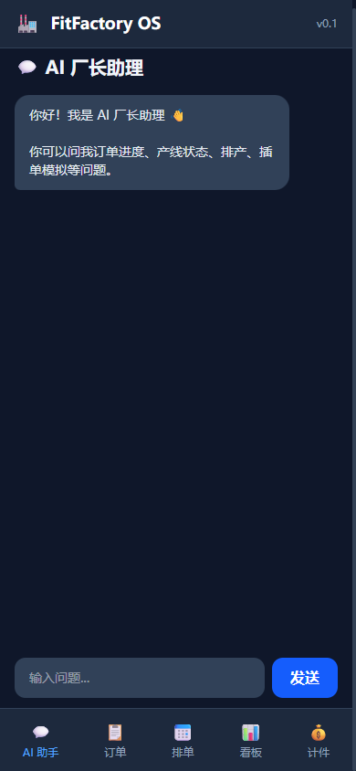
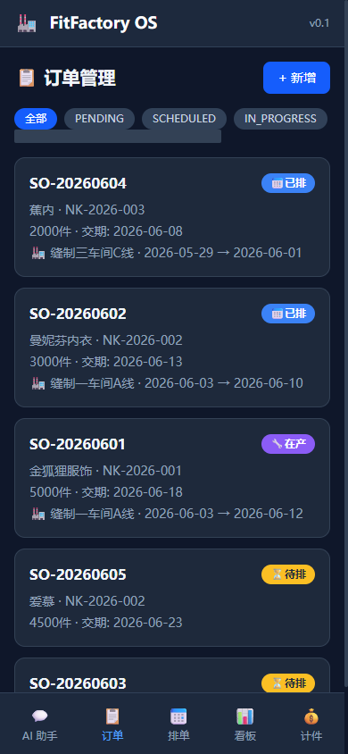
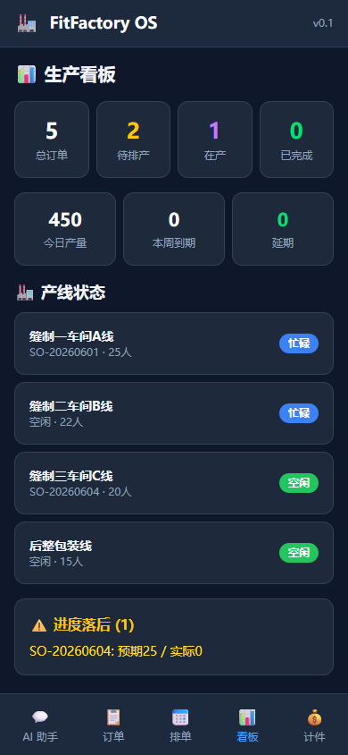
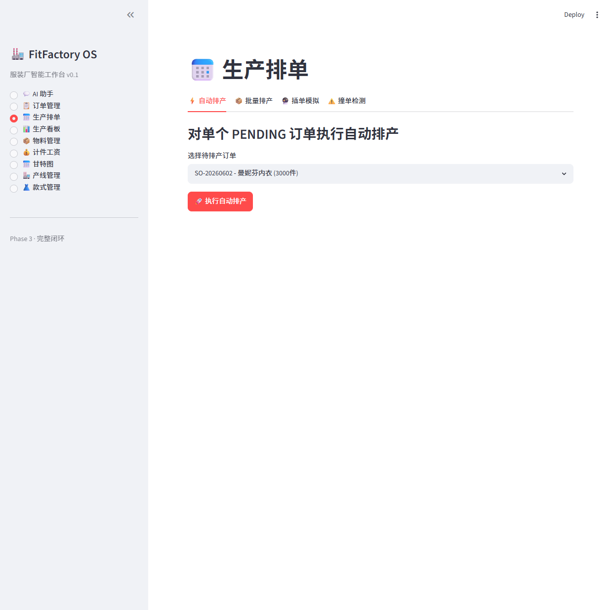
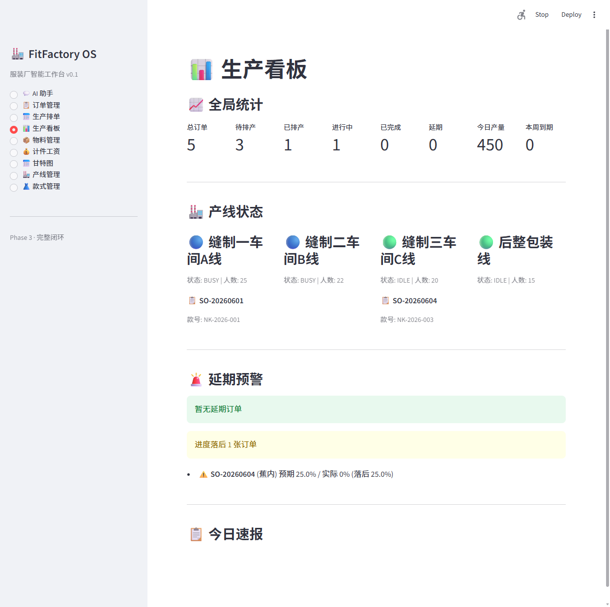

# FitFactory OS — 项目功能清单

> 服装厂智能工作台 | 49/49 任务完成 | 2026-05-29

---

## 一、系统概览

| 项目 | 详情 |
| --- | --- |
| 定位 | 服装厂厂长助理 AI 工作台 |
| 架构 | FastAPI + React PWA + Streamlit(备用) + SQLite |
| AI 引擎 | DeepSeek Chat + Function Calling (8 工具) |
| 部署 | 本地单机 → 局域网手机 → Cloudflare 公网(可配) |

### 访问地址

| 服务 | 地址 | 用途 |
| --- | --- | --- |
| 后端 API | `http://localhost:8000` | 数据接口 |
| API 文档 | `http://localhost:8000/docs` | Swagger 交互文档 |
| React 前端 | `http://localhost:5173` | 手机/PC 响应式界面 |
| Streamlit 前端 | `http://localhost:8501` | 备用桌面界面 |
| 手机访问 | `http://192.168.x.x:5173` | 连 WiFi 即可用 |

---

## 二、功能模块

### 📅 生产排单引擎

| 功能 | 说明 | API |
| --- | --- | --- |
| 自动排产 | 输入订单 → AI 匹配产线 → 推荐开工/完工日期 | `POST /api/schedule/auto` |
| 撞单检测 | 扫描所有已排产订单，标出时间重叠 | `GET /api/schedule/conflicts` |
| 插单模拟 | 模拟插入新订单 → 列出受影响订单 + 延期天数 | `POST /api/schedule/simulate-insertion` |
| 批量排产 | 一次排完所有 PENDING 订单 | `POST /api/schedule/batch` |
| 产能预警 | 未来 N 天产线负荷超过阈值 → 警告 | `GET /api/schedule/capacity-warning` |
| AI 排序 | DeepSeek 对候选方案二次智能排序，失败降级硬规则 | 排单引擎内置 |

**排单算法**: 款式产能匹配 → 产线空闲窗口计算 → 物料齐套检查 → AI 排序推荐

---

### 📦 物料管理

| 功能 | 说明 | API |
| --- | --- | --- |
| 物料 CRUD | 增删改查物料主数据 | `GET/POST/PUT/DELETE /api/materials/` |
| 入库登记 | 增加库存，记录流水 | `POST /api/materials/transactions/in` |
| 出库登记 | 扣减库存（不足时拒绝），关联订单 | `POST /api/materials/transactions/out` |
| 库存流水 | 按物料查看历史出入库 | `GET /api/materials/transactions/` |
| 齐套检查 | 按订单 BOM 逐一核对物料是否够 | `GET /api/materials/check/{order}` |
| 缺料预警 | 库存 < 安全库存的物料列表 | `GET /api/materials/shortage-alert` |
| 采购建议 | 所有 PENDING 订单需求量 - 库存 = 建议采购量 | `GET /api/materials/purchase-suggestion` |

---

### 📊 生产看板

| 功能 | 说明 | API |
| --- | --- | --- |
| 全局统计 | 总订单/待排/在产/完成/延期 + 今日产量 | `GET /api/dashboard/overview` |
| 产线状态 | 每条产线的负载、当前订单、可用日期 | overview 内含 |
| 订单追踪 | 单笔订单各工序进度 + 每日趋势 | `GET /api/dashboard/order/{order}` |
| 延期预警 | 已延期订单 + 进度落后 20%+ 的风险订单 | `GET /api/dashboard/delays` |
| 日报摘要 | 今日产量/在岗人数/新增订单 | `GET /api/dashboard/daily-report` |
| 甘特图 | 产线 × 时间 × 订单排期数据 | `GET /api/dashboard/gantt` |
| 进度刷新 | 手动触发全量订单进度重算 | `POST /api/dashboard/refresh-progress` |

---

### 💰 计件工资

| 功能 | 说明 | API |
| --- | --- | --- |
| 计件录入 | 单条录入（工人/订单/工序/数量/单价/日期） | `POST /api/piecework/` |
| 批量导入 | 一次导入多条计件记录 | `POST /api/piecework/batch` |
| 按日查询 | 按日期/工人/订单筛选 | `GET /api/piecework/` |
| 月度汇总 | 按月汇总工资，自动标记异常（偏离均值 >30%） | `GET /api/payroll/monthly` |
| 单人历史 | 查看工人近 3 月工资趋势 | `GET /api/payroll/worker/{name}` |

**工资异常检测**: 自动计算月均值，偏差超过 30% 标记审查。

---

### 💬 AI 智能问答

| 能力 | 说明 |
| --- | --- |
| 自然语言查数据 | "SO-001 做到哪了" → Agent 自动调用工具查数据库 |
| 自动排产 | "帮我排 SO-001" → Agent 调用排单引擎 |
| 插单模拟 | "插 3000 件 NK-002 行不行" → Agent 运行模拟 |
| 产线查询 | "产线状态怎么样" → 返回全部产线负载 |
| 到期预警 | "下周要交哪些" → 列出到期订单 |
| 知识检索 | "蕾丝缩水怎么处理" → RAG 检索工艺标准 SOP |
| 多轮对话 | 上下文保持，追问无需重复背景 |

**Agent 工具链 (8 个)**:

| 工具 | 用途 |
| --- | --- |
| `query_database` | 执行 SELECT 查询 |
| `get_order_status` | 查订单详情 + 进度 |
| `simulate_insertion` | 插单影响推演 |
| `get_production_lines` | 产线状态 |
| `get_upcoming_orders` | 即将到期订单 |
| `get_dashboard_stats` | 生产统计 |
| `get_delay_warnings` | 延期预警 |
| `run_auto_schedule` | 自动排产 |

---

### 🧠 知识库 (RAG)

| 功能 | 数量 | 说明 |
| --- | --- | --- |
| 工艺标准 | 6 条 | 裁剪规范/缝制质量/缩水处理/质检标准/包装标准/设备维护 |
| SOP 文档 | 5 条 | 订单延期/质量问题/设备故障/客户插单/缺料应急处理流程 |
| 语义检索 | `GET /api/knowledge/search?query=...` | 关键词 + 字符重叠评分 |
| 知识库统计 | `GET /api/knowledge/stats` | 文档总数 |

**示例检索**:
- "面料缩水怎么处理" → 返回「面料缩水处理标准」+ 相关 SOP
- "设备坏了" → 返回「设备故障应急处理」+「缝制设备日常维护」

---

### 🔔 消息推送

| 场景 | 触发条件 | 优先级 |
| --- | --- | --- |
| 缺料预警 | 库存 < 安全库存 | HIGH（企微推送） |
| 订单延期 | 延期 ≥ 2 天 | HIGH |
| 订单完成 | 进度 100% | MEDIUM |
| 产线异常 | 停机 > 2 小时 | HIGH |
| 日报 | 每日 18:00 | MEDIUM |
| 产能超标 | 利用率 > 90% | HIGH |

推送渠道: 企业微信 Webhook + 本地日志文件 `data/notifications.log`

---

### 📁 报表导出

| 报表 | 格式 | API |
| --- | --- | --- |
| 订单报表 | Excel (.xlsx) | `GET /api/export/orders` |
| 工资报表 | Excel (.xlsx) | `GET /api/export/payroll?year=&month=` |
| 物料库存 | Excel (.xlsx) | `GET /api/export/materials` |

---

### 🔐 认证权限

| 角色 | 账号 | 密码 | 权限 |
| --- | --- | --- | --- |
| 管理员 | admin | admin123 | 全部功能 |
| 只读用户 | viewer | view123 | 查看 |

认证方式: Basic Auth (`Authorization: Basic base64(user:pass)`)

---

## 三、数据模型 (10 张表)

| 表 | 说明 | 关键字段 |
| --- | --- | --- |
| `styles` | 款式主数据 | style_code, standard_capacity(JSON), bom_data(JSON) |
| `production_lines` | 产线 | line_name, status, available_from |
| `orders` | 订单 | order_number, style_code, delivery_date, assigned_line |
| `materials` | 物料 | material_code, current_stock, safety_stock, supplier |
| `inventory_transactions` | 库存流水 | material_code, type(IN/OUT), quantity |
| `material_availability` | 齐套结果 | order_number, material_code, status(READY/SHORTAGE) |
| `piece_work_records` | 计件记录 | worker_name, order_number, quantity, unit_price |
| `order_progress` | 进度快照 | order_number, completed_qty, completion_rate |
| `craft_standards` | 工艺标准 | style_code, process_name, standard_time_sec |
| `exception_events` | 异常事件 | order_number, event_type, severity |

---

## 四、前端界面

### React PWA (手机优先 · iPhone 14 尺寸)

| 页面 | 移动端特性 |
| --- | --- |
| 💬 AI 助手 | 聊天气泡 + 底部固定输入框 + 自动滚动 |
| 📋 订单 | 卡片列表 + 状态筛选标签 + 新增表单 |
| 📅 排单 | 三 Tab (自动/模拟/撞单) + 结果卡片 |
| 📊 看板 | 响应式网格 + 红黄绿状态色 |
| 💰 计件 | 大字输入框 + 扫码枪友好 + 成功反馈 |

底部导航栏: 固定 5 项，手机原生 App 体验。PWA 可添加到主屏幕。

#### 📱 移动端截图

**💬 AI 智能问答**


**📋 订单管理**


**📊 生产看板**


### Streamlit (桌面备用)

9 个页面: AI 助手/订单/排单/看板/物料/计件/甘特图/产线/款式

#### 🖥️ 桌面端截图

**📅 生产排单**


**📊 看板大屏**


---

## 五、技术栈

| 层 | 技术 |
| --- | --- |
| 后端框架 | FastAPI (Python 3.14) |
| 数据库 | SQLite → 可迁移 PostgreSQL |
| ORM | SQLAlchemy 2.0 |
| AI 模型 | DeepSeek Chat (Function Calling) |
| 前端 | React 19 + TypeScript + Vite 8 |
| 样式 | Tailwind CSS 4 |
| PWA | manifest.json + 响应式 + 离线优化 |
| Streamlit | 备用桌面 UI |
| 导出 | openpyxl (Excel) |
| 推送 | 企业微信 Webhook |

---

## 六、快速启动

```bash
# 后端
cd C:\Users\16565\Documents\AI_work\fitfactory-os
python3 -m uvicorn src.main:app --host 0.0.0.0 --port 8000 --reload

# React 前端 (另一个终端)
cd frontend && npm run dev

# 填充种子数据
python3 src/seed_data.py

# 运行测试
python3 tests/test_suite.py
```

---

*文档生成: 2026-05-29 · FitFactory OS v0.1*
